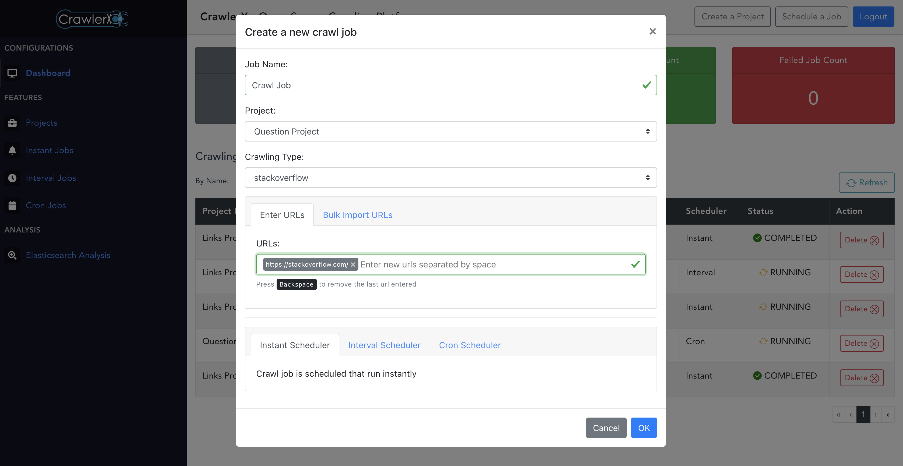

# CrawlerX - Develop Extensible, Distributed, Scalable Crawler System

The CrawlerX is a platform which we can use for crawl web URLs in different kind of protocols in a distributed way. Web crawling often called web scraping is a method of programmatically going over a collection of web pages and extracting data which useful for data analysis with web-based data. With a web scraper, you can mine data about a set of products, get a large corpus of text or quantitative data to play around with, get data from a site without an official API, or just satisfy your own personal curiosity.


CrawlerX includes the following runtimes to do the crawling jobs for you.

- **VueJS Frontend** - Dashboard which users intercat
- **Firebase** - User authorization & authentication
- **Django Backend Server** - which expose API endpoints for the frontend
- **RabbitMQ Server** - Message broker
- **Celery Beat and Workers** - Job Scheduler and executor
- **Scrapy Server** - for extracting the data you need from websites
- **MongoDB Server** - for store crawled data
- **ElasticSearch**- for job/query seaching mechanisams

## CrawlerX Dashboard

In the CrawlerX dashboard, you can get an abstract idea of the crawled and crawling projects and jobs with their status.


## Crawl Job Scheduling

In CrawlerX, you can schedule crawl jobs in three ways. 

- **Instant Scheduler** - Crawl job is scheduled that run instantly
- **Interval Scheduler** - Crawl job is scheduled that run at a specific interval
- **Cron Scheduler** - Crawl job is scheduled that run as a cron job



### Prerequisites
First you need to edit the `.env` file in `crawlerx_app` root directory with your web app's firebase configuration details.
```
VUE_APP_FIREBASE_API_KEY = "<your-api-key>"
VUE_APP_FIREBASE_AUTH_DOMAIN = "<your-auth-domain>"
VUE_APP_FIREBASE_DB_DOMAIN= "<your-db-domain>"
VUE_APP_FIREBASE_PROJECT_ID = "<your-project-id>"
VUE_APP_FIREBASE_STORAGE_BUCKET = "<your-storage-bucket>"
VUE_APP_FIREBASE_MESSAGING_SENDER_ID= "<your-messaging-sender-id>"
VUE_APP_FIREBASE_APP_ID = "<your-app-id>"
VUE_APP_FIREBASE_MEASURMENT_ID = "<your-measurementId>"
```

### Setup on the Container based Environments

#### Kubernetes Helm Deployment

[See the helm deployment documentation](crawlerx_helm/README.md)

#### Docker Composer

Please follow the below steps to setup CrawlerX on the container environment.

```sh
docker-compose up --build
```

Open http://localhost:8080 to view the CrawlerX web UI in the browser.

### Setup on the VM based Environment

#### Please follow the below steps in order to set it up CrawlerX in your VM based environment.

Start RabbitMQ broker

```sh
$ docker run -d --hostname my-rabbit --name some-rabbit -p 8080:15672 rabbitmq:3-management
```

Start MongoDB Server

```sh
$ docker run -d -p 27017:27017 --name some-mongo \
    -e MONGO_INITDB_ROOT_USERNAME=<username> \
    -e MONGO_INITDB_ROOT_PASSWORD=<password> \
    mongo
```

Start Scrapy Daemon (after installing scrpay daemon)

```sh
$ cd scrapy_app
$ scrapyd
```

Start ElasticSearch
```sh
$ docker run -p 9200:9200 -p 9300:9300 -e "discovery.type=single-node" elasticsearch:7.8.1
```

Start Celery Beat
```sh
$ cd crawlerx_server
$ celery -A crawlerx_server beat -l INFO
```

Start Celery Worker
```sh
$ cd crawlerx_server
$ celery -A crawlerx_server worker -l INFO
```

Start the Django backend :

```sh
$ pip install django
$ cd crawlerx_server
$ python3 manage.py runserver
```

Start the frontend :

```sh
$ cd crawlerx_app
$ npm install
$ npm start
```

### Todos

- Tor URL crawler

## License

MIT
