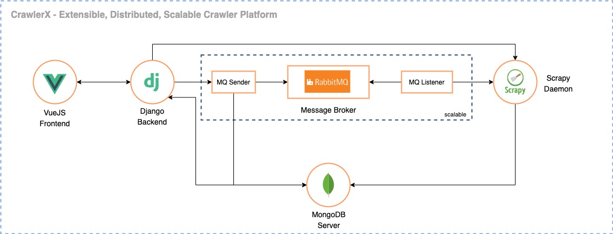

# CrawlerX - Develop Extensible, Distributed, Scalable Crawler System

##### Note: Readme is still in-progress

The CrawlerX is a platform which we can use for crawl web URLs in different kind of protocols in a distributed way. Web crawling often called web scraping is a method of programmatically going over a collection of web pages and extracting data which useful for data analysis with web-based data. With a web scraper, you can mine data about a set of products, get a large corpus of text or quantitative data to play around with, get data from a site without an official API, or just satisfy your own personal curiosity. 



CrawlerX includes the following runtimes to do the crawling jobs for you. 

- **VueJS Frontend** - Dashboard which users intercat
- **Firebase** - User authorization & authentication
- **Django Backend Server** - which expose API endpoints for the frontend 
- **RabbitMQ Server** - Message broker 
- **RabbitMQ Listeners** - consumes messages from the RabbitMQ queue
- **Scrapy Server** - for extracting the data you need from websites
- **MongoDB Server** - for store crawled data

### Setup

Please follow the below steps in order to set it up CrawlerX in your VM based environment.

Start the frontend :
```sh
$ cd crawlerx_app
$ npm install 
$ npm start
```

Start the Django backend :
```sh
$ pip install django
$ cd crawlerx_server
$ python3 manage.py startapp main
```

Start RabbitMQ broker

```sh
$ docker pull rabbitmq
$ docker run -d --hostname my-rabbit --name some-rabbit -p 8080:15672 rabbitmq:3-management
```

Start RabbitMQ Listener
```sh
$ cd scrapy_app/rabbitmq_broker
$ python3 rabbitmq_consumer.py
```

Start MongoDB Server
```sh
$ docker pull mongo
$ docker run -d -p 27017:27017 --name some-mongo \
    -e MONGO_INITDB_ROOT_USERNAME=<username> \
    -e MONGO_INITDB_ROOT_PASSWORD=<password> \
    mongo
```

Start Scrapy Daemon (after installing scrpay daemon)
```sh
$ cd scrapy_app
$ scrapyd
```

#### Docker + Kubernetes

Above server configurations need to be wrap with Docker images and write k8s deployment files.

### Todos

 - Improve VueJS based frontend with functionalities.
 - User based data storing
 - Guaranteed delivery for RabbitMQ consumers
 - ELK based analysis
 - Documentation

License
----
MIT

